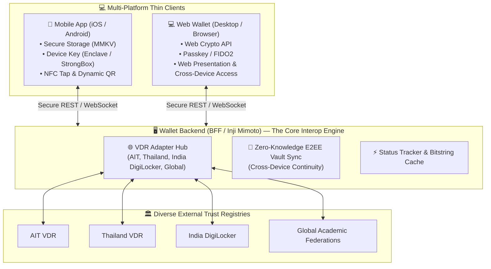
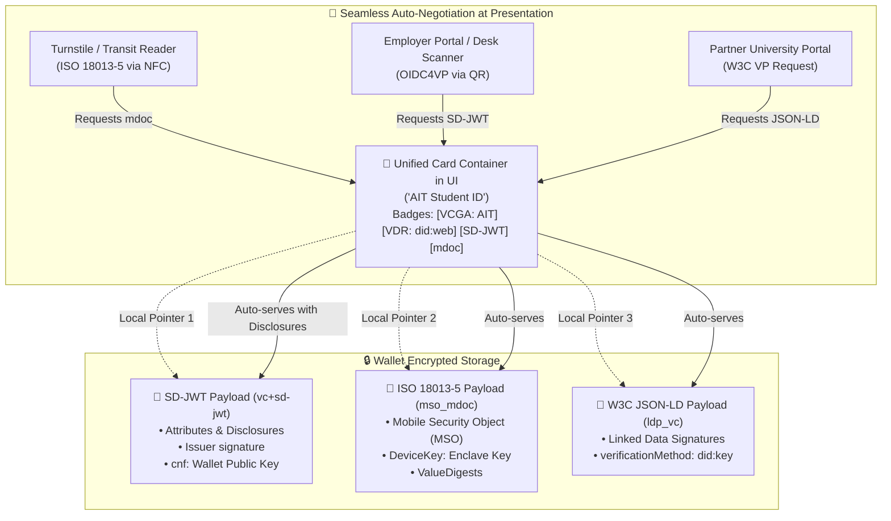
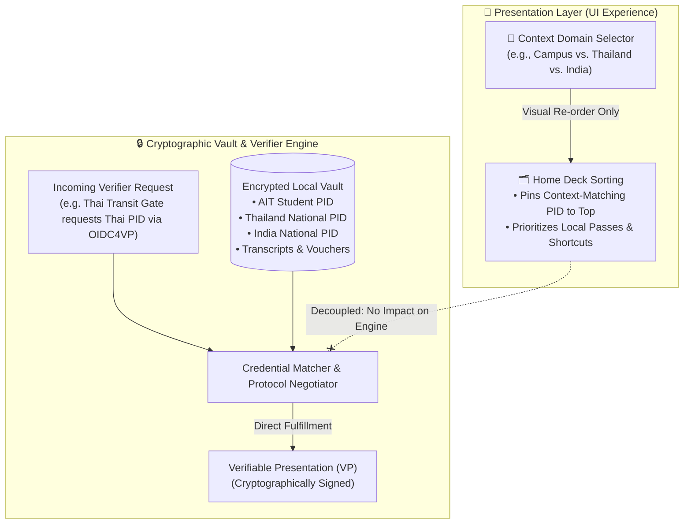
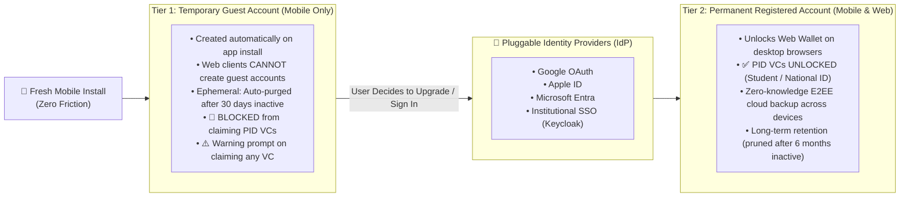

# AIT Wallet (Universal Verifiable Credential Wallet)

[](https://w3.org/TR/vc-data-model-2.0/)
[-green.svg)](#architecture)
[-orange.svg)](https://github.com/mosip/inji-wallet)
[](LICENSE)

The **AIT Wallet** is an open, universal decentralized identity and Verifiable Credential (VC) wallet. Engineered on international open standards, it functions as an agnostic, privacy-preserving digital vault capable of receiving, holding, and presenting cryptographically verifiable credentials from **any Governance Authority (VCGA) and Verifiable Data Registry (VDR) worldwide**.

---

## 🌐 Core Capabilities: The 3 Architectural Pillars

### 1. Multi-Platform BFF Architecture & Cross-Device Sync
The heart of the wallet is the **Wallet Backend (BFF / Inji Mimoto)**. Both the **Mobile App (iOS / Android)** and the **Web Wallet (Desktop Browsers)** operate as ultra-lightweight, durable thin clients, delegating the heavy lifting of multi-registry interoperability and data synchronization to the backend.



#### 🛡️ Cross-Device Continuity & Zero-Knowledge E2EE Vault Recovery
To enable seamless multi-device access and ensure users never lose their credentials upon device loss or replacement, the wallet implements **Zero-Knowledge End-to-End Encrypted (E2EE) Vault Synchronization**:

```text
┌────────────────────────────────────────────────────────────────────────┐
│             🔄 CROSS-DEVICE CONTINUITY & RECOVERY FLOW                  │
└────────────────────────────────────────────────────────────────────────┘

 [1. NORMAL USAGE]
  Mobile Wallet holds VCs ───► Encrypts Vault with User Key (Passkey/PRF)
                                            │
                                            ▼
                           BFF stores Zero-Knowledge Encrypted Blob
                           (BFF cannot read, view, or forge VCs)
                                            │
 [2. DEVICE LOSS OR REPLACEMENT]            │
  Phone is lost, upgraded, or damaged       │
                                            │
 [3. INSTANT RESTORATION]                   │
  User opens Web Wallet (Laptop) OR         │
  installs App on replacement phone         ▼
  Authenticates via SSO ───────► Downloads E2EE Encrypted Blob from BFF
                                            │
                                            ▼
  Enters Recovery Passkey ─────► Decrypts vault locally on new device
                                 100% of credentials restored! Zero data loss!
                                            │
 [4. HARDWARE KEY RE-BINDING]               ▼
  New device registers fresh keypair; previous device keys invalidated.
```

#### ⚡ Why the BFF is the Engine of Interoperability

| Architectural Dimension | Traditional Fat-Client Wallet | Our BFF-Driven Multi-Platform Wallet |
| :--- | :--- | :--- |
| **Supported Platforms** | iOS / Android only | **Multi-Platform**: iOS, Android, and Desktop Web |
| **Device Loss / Replacement** | ❌ **Permanent Loss**: User must re-verify identity in person | ✅ **Zero Data Loss**: Instant restore via E2EE vault sync on Web or replacement phone |
| **New Country / VDR Integration** | ❌ Heavy client updates; app store delays (weeks) | ✅ **Instant Server-Side Integration**: Pluggable VDR adapter added to BFF with **zero app store updates** |
| **Revocation List Polling** | ❌ Drains mobile battery decompressing large bitstring lists | ✅ **BFF Cached**: BFF polls, decompresses, and delivers lightweight status flags to clients |
| **Data Privacy** | Local device only | **Zero-Knowledge Architecture**: BFF only stores ciphertext; cannot see plaintext VC data |

### 2. Multi-Document Format & Multi-VDR Presentation Design
The wallet supports all major international credential formats and registries. Rather than cluttering the user interface with separate duplicate cards for each format or registry, the wallet implements a **Unified Card Container** with **visual metadata tags** for format capabilities and VDR anchors:

#### 🪪 Visual Card Presentation with Format & VDR Tags

```text
┌────────────────────────────────────────────────────────────────────────┐
│  🏫 ASIAN INSTITUTE OF TECHNOLOGY                                      │
│  STUDENT IDENTIFICATION CARD                               [🟢 ACTIVE]  │
│                                                                        │
│  ┌──────────┐  NAME: Somchai Jaidee                                    │
│  │          │  ID:   st125088                                          │
│  │  [PHOTO] │  PROG: Computer Science (M.Eng.)                         │
│  │          │  EXP:  MAY 2026                                          │
│  └──────────┘                                                          │
│                                                                        │
│  ── 🏛️ Governance & Trust Registries (VDR) ───────────────────────────  │
│  [🏛️ VCGA: AIT]  [🌐 VDR: did:web:id.ait.ac.th]  [🇹🇭 VDR: Thailand]     │
│                                                                        │
│  ── 📦 Available Payload Formats ─────────────────────────────────────  │
│  [⚡ SD-JWT (QR / Web)]    [📶 mdoc (NFC Proximity)]   [🔗 W3C JSON-LD]  │
└────────────────────────────────────────────────────────────────────────┘
```

#### 🏷️ Tag Anatomy & Capabilities

| Tag Type | Example Badges in UI | Functional Meaning & Purpose |
| :--- | :--- | :--- |
| **VCGA Tag** | `[🏛️ VCGA: AIT]` | Identifies the issuing governance authority setting trust policies, credential schemas, and business rules. |
| **VDR Tag(s)** | `[🌐 VDR: did:web]`<br>`[🇹🇭 VDR: Thailand]` | Indicates which public registry anchors the issuer's public keys and bitstring revocation status list. A card can be cross-registered across multiple VDRs. |
| **Format: SD-JWT** | `[⚡ SD-JWT]` | **Attribute Selective Disclosure**: Encrypted payload formatted as IETF SD-JWT (`vc+sd-jwt`) for QR-code presentation and online OIDC4VP web sessions, allowing users to conceal sensitive fields. |
| **Format: mdoc** | `[📶 mdoc]` | **Hardware Proximity Tap**: Binary CBOR payload formatted as ISO/IEC 18013-5 (`mso_mdoc`) for high-speed offline NFC taps at campus turnstiles, library gates, and public transit. |
| **Format: W3C VC** | `[🔗 W3C JSON-LD]` | **Semantic Interoperability**: Formatted as W3C JSON-LD (`ldp_vc`) for cross-border academic verification with international partner universities. |

#### ⚙️ Under-the-Hood: Multi-Format Storage & Auto-Negotiation
The card shown in the UI is a **logical container**. Under the hood, the wallet holds distinct cryptographic payloads in local encrypted storage. When interacting with a verifier, the wallet auto-negotiates the optimal format without requiring the user to manually configure protocols:



### 3. Presentation-Level Context Selector
Just like switching an app language or display theme, users can select an **Active Context Domain** (e.g. *AIT Campus*, *Thailand*, *India*, or *Global*). 

Functionality-wise, **nothing changes in the cryptographic engine**: all credentials in the local vault remain active and discoverable. The selector acts strictly as a **presentation-layer convenience**, pinning and spotlighting the relevant primary Person Identification Data (PID) card at the top of the wallet deck.

#### 📱 UI Mockup: Context Selector & Dynamic Card Spotlighting

```text
┌────────────────────────────────────────────────────────────────────────┐
│  AIT Wallet                                                 ⚙️ Settings │
│                                                                        │
│  📍 ACTIVE CONTEXT:                                                    │
│  ┌───────────────────┐ ┌───────────────────┐ ┌───────────────────┐     │
│  │ 🏫 AIT Campus [●] │ │ 🇹🇭 Thailand   [ ] │ │ 🇮🇳 India      [ ] │ ... │
│  └───────────────────┘ └───────────────────┘ └───────────────────┘     │
│                                                                        │
│  ⭐ SPOTLIGHTED PID (AIT Campus Context Active)                        │
│  ┌──────────────────────────────────────────────────────────────────┐  │
│  │  🏫 ASIAN INSTITUTE OF TECHNOLOGY                    [🟢 ACTIVE]  │  │
│  │  STUDENT IDENTIFICATION CARD (PID)                               │  │
│  │  Somchai Jaidee • st125088 • Computer Science (M.Eng.)           │  │
│  │  [🏛️ VCGA: AIT]  [🌐 VDR: did:web]  [⚡ SD-JWT]  [📶 mdoc]         │  │
│  └──────────────────────────────────────────────────────────────────┘  │
│                                                                        │
│  📂 CAMPUS CREDENTIALS & VOUCHERS                                      │
│  ┌──────────────────────────────────────────────────────────────────┐  │
│  │  📜 Academic Transcript (SD-JWT)               Issued: May 2026  │  │
│  │  🎟️ Canteen Meal Voucher (One-Time)            Expires: Today    │  │
│  └──────────────────────────────────────────────────────────────────┘  │
│                                                                        │
│  🌐 OTHER REGIONAL VAULT CREDENTIALS (Always Available to Verifiers)   │
│  ┌──────────────────────────────────────────────────────────────────┐  │
│  │  🇹🇭 Thailand National Digital ID (PID)        [🇹🇭 VDR: Thailand]  │  │
│  │  🇮🇳 India Academic Bank of Credits (ABC)       [🇮🇳 DigiLocker]    │  │
│  └──────────────────────────────────────────────────────────────────┘  │
└────────────────────────────────────────────────────────────────────────┘
```

When switching the context to **`[ 🇹🇭 Thailand ]`**, the presentation deck instantly reorganizes:

```text
┌────────────────────────────────────────────────────────────────────────┐
│  ⭐ SPOTLIGHTED PID (Thailand Context Active)                          │
│  ┌──────────────────────────────────────────────────────────────────┐  │
│  │  🇹🇭 THAILAND NATIONAL DIGITAL ID (PID)               [🟢 ACTIVE]  │  │
│  │  Somchai Jaidee • ID: 1-xxxx-xxxxx-xx-x                          │  │
│  │  [🏛️ VCGA: Thailand]  [🌐 VDR: Thailand]  [⚡ SD-JWT]             │  │
│  └──────────────────────────────────────────────────────────────────┘  │
│                                                                        │
│  📂 SECONDARY / CAMPUS CREDENTIALS                                     │
│  ┌──────────────────────────────────────────────────────────────────┐  │
│  │  🏫 AIT Student ID (PID)                       [🏛️ VCGA: AIT]     │  │
│  │  📜 AIT Academic Transcript                    [⚡ SD-JWT]        │  │
│  └──────────────────────────────────────────────────────────────────┘  │
└────────────────────────────────────────────────────────────────────────┘
```

#### ⚖️ Presentation Layer vs. Cryptographic Engine

| Architectural Dimension | Presentation Layer (UI Experience) | Cryptographic Vault Engine (Under-the-Hood) |
| :--- | :--- | :--- |
| **Primary Role** | Visual convenience & ergonomic card prioritization. | Neutral, privacy-preserving credential storage & signing. |
| **Context Switching** | Moves the selected domain's PID to the top; groups relevant cards. | **Zero state change**: All credentials remain fully active. |
| **Verifier Inquiries** | Not involved in verifier protocol handshakes. | Fulfills any valid OIDC4VP request for any stored credential, regardless of which card is visually spotlighted. |
| **Cross-Border Usability** | User easily navigates between campus, national, and international cards. | Verifies foreign signatures via BFF VDR Adapter Hub without requiring UI context changes. |

#### 🔄 Architectural Decoupling: UI Presentation vs. Verifier Query



---

## 👤 Tiered Account Model: Guest to Permanent Upgrade

The wallet employs a progressive, two-tier account architecture designed for instant zero-friction onboarding while protecting sensitive foundational identity credentials and managing backend retention costs:



### Tier 1: Temporary Guest Account (Mobile Only)
- **Instant Activation**: Created automatically on fresh mobile installation without requiring an email, phone number, or password. (*Web browsers cannot create guest accounts; Web requires authentication*).
- **Claim Warning UX**: When a guest user attempts to claim any Verifiable Credential (such as an event badge or campus meal ticket), the app presents an explicit prompt:
  > ⚠️ **Guest Mode Notice**: You are using a temporary Guest Account. If you delete or reinstall the app, your credentials will be permanently lost. Upgrade to a permanent account anytime to secure your wallet.
- **Strict PID Guard**: The mobile app **strictly blocks claiming any Person Identification Data (PID)** (e.g. Student ID, Citizen ID, Staff ID) in Guest Mode. PIDs legally and architecturally require an authenticated, verified user account.
- **Inactivity Deletion**: To prevent orphan storage bloat, guest accounts inactive for **30 days** are automatically cleaned up.

### Tier 2: Permanent Registered Account (Multi-Platform)
- **Seamless In-Place Upgrade**: Upgrading does not wipe the wallet. The existing guest vault, keys, and already claimed vouchers are smoothly migrated into the permanent account.
- **Pluggable IdP Adapters**: Users authenticate using pluggable identity providers configured for their deployment:
  - **Social / Consumer**: Google OAuth, Apple Account, Microsoft Account.
  - **Institutional / Enterprise**: Campus SSO (Keycloak, OpenID Connect, SAML).
- **Full PID Capabilities**: Users are unlocked to claim, hold, and present official Person Identification Data (PIDs), verified academic transcripts, and professional licenses.
- **Cross-Platform Access**: Full access to the **Web Wallet** on desktop browsers with continuous synchronization.
- **Storage Lifecycle & Cost Efficiency**: Maintained for multi-year duration while active. To manage server costs sustainably, accounts inactive for **6 months** receive notification warnings prior to vault archiving.

| Feature / Policy | 📱 Tier 1: Temporary Guest Account | 🌐 Tier 2: Permanent Registered Account |
| :--- | :--- | :--- |
| **Supported Platforms** | **Mobile only** (fresh iOS / Android install) | **Multi-Platform**: Mobile + Desktop Web |
| **Onboarding Requirement** | Zero credentials (instant on app launch) | Authenticated via Pluggable IdP (Google, Apple, Microsoft, SSO) |
| **Claiming Person ID (PID)** | 🚫 **Strictly Blocked** (PID requires verified account) | ✅ **Unlocked** (Student ID, Citizen ID, Faculty ID) |
| **Claiming Non-PID VCs** | ⚠️ Allowed with data loss warning prompt | ✅ Allowed without warnings |
| **Cross-Device E2EE Sync** | ❌ None (Local device only) | ✅ Full Zero-Knowledge E2EE Sync across Mobile & Web |
| **Inactivity & Retention Policy** | Auto-purged after **30 days** of inactivity | Retained for years; pruned after **6 months** of inactivity |
| **Upgrade Path** | 1-tap in-place transition to Tier 2 | N/A (Already permanent) |

---

## 🌟 Key Capabilities

- **Universal Credential Ingestion**: Scans dynamic QR codes or receives deep links via **OpenID for Verifiable Credential Issuance (OIDC4VCI)**.
- **Hardware-Enforced Proof of Possession**: Generates asymmetric keypairs within the device's Secure Enclave / Android KeyStore. Credentials cannot be duplicated, screenshotted, or exported to another device.
- **Privacy & Selective Disclosure**: Discloses only required attributes using **IETF SD-JWT** without exposing private personal identifiers.
- **Multi-Transport Presentation**: Presents credentials online via **OIDC4VP**, over local **Bluetooth Low Energy (BLE)**, or via **ISO 18013-5 NFC tap**.
- **Offline Signature & Status Verification**: Cryptographic signatures are verifiable offline without calling central issuer databases.

---

## 📁 Repository Structure

```text
.
├── apps/
│   ├── mobile/                    # AIT Mobile Wallet (React Native / Inji Mobile framework)
│   └── web/                       # Web Wallet architecture boundary
├── packages/
│   └── branding/                  # Design tokens, color palettes, and card UI dimensions
├── docs/
│   ├── ARCHITECTURE.md            # Technical architecture, VDR adapters, and client-server boundaries
│   ├── GLOBAL_STANDARDS_AND_REGISTRIES.md # National ID & University Transcript global standards
│   ├── LEARNING_GUIDE.md          # Foundational concepts, trust architecture, and jargon buster
│   ├── USE_CASES.md               # End-to-end user flows (National ID, Transcripts, Guest Mode)
│   ├── VISION_AND_ROADMAP.md      # Project vision, milestones, and governance model
│   └── WORKFLOW_AND_GUIDELINES.md # Contribution guide, Git branching, and DoD
├── .github/
│   ├── ISSUE_TEMPLATE/            # Templates for bug reports, features, and use case proposals
│   └── PULL_REQUEST_TEMPLATE.md
├── AGENT.md                       # AI Agent & Developer Guidelines (Prime Directives & Invariants)
├── LICENSE                        # Apache 2.0 License
└── README.md                      # Main project documentation (this file)
```

---

## 🛠️ Technology Stack

- **Mobile Client**: [MOSIP Inji Wallet](https://github.com/mosip/inji-wallet) (React Native, TypeScript, Hermes Engine)
- **Wallet Backend (BFF)**: [MOSIP Inji Mimoto](https://github.com/mosip/mimoto) (VDR Adapter Hub, Status Synchronization, Key & Schema Cache)
- **Supported Formats**: IETF SD-JWT (`vc+sd-jwt`), ISO/IEC 18013-5 mdoc (`mso_mdoc`), W3C Verifiable Credentials (JSON-LD)
- **Trust & Federation Protocols**: OpenID Federation 1.0 (OIDFed), W3C Bitstring Status List
- **Issuance & Presentation Protocols**: OIDC4VCI (Issuance), OIDC4VP (Presentation)
- **Proximity & Transport**: ISO 18013-5 NFC, Dynamic QR, and BLE (MOSIP Tuvali)
- **Target OS**: iOS 14+ and Android 8.0+ (API 26+)

---

## 📖 Documentation Index

- 🤖 **[AI Agent & Developer Guidelines](AGENT.md)** *(Mandatory for AI agents & contributors)*
- 🎓 **[VCs & Decentralized Identity: AIT Learning Guide](docs/LEARNING_GUIDE.md)** *(Recommended Starting Point)*
- 📐 [Technical Architecture & VDR Adapter Hub](docs/ARCHITECTURE.md)
- 🌐 [Global Standards, Dual-Contexts & VDRs (National ID & Transcript)](docs/GLOBAL_STANDARDS_AND_REGISTRIES.md)
- 🔄 [Consolidated Use Cases (Digital ID, Academic Transcript, Guest Mode)](docs/USE_CASES.md)
- 📋 [Vision & Focused Roadmap](docs/VISION_AND_ROADMAP.md)
- 🤝 [Development Workflow & Contribution Guidelines](docs/WORKFLOW_AND_GUIDELINES.md)

---

## 📄 License

Licensed under the [Apache License, Version 2.0](LICENSE).
