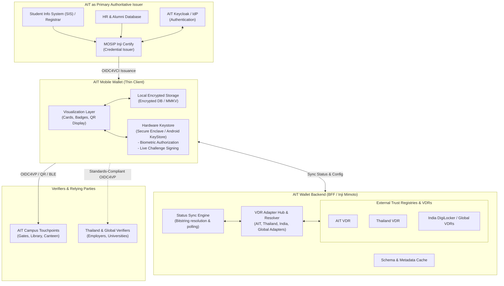
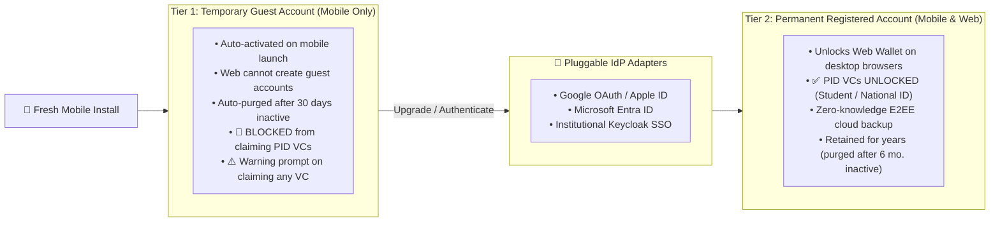
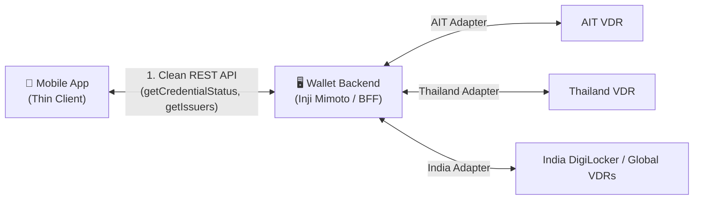

# Technical Architecture & Trust Framework — AIT Wallet

---

## 🏛️ 1. System Architecture

The AIT Wallet operates as a decentralized identity client aligned with the **MOSIP Inji Stack** and the **Thailand Verifiable Credential Trust Framework**.



---

## 🇹🇭 2. Thailand Trust Framework Alignment

The wallet adopts open digital credential standards recognized in **Thailand** to ensure full national and regional interoperability.

### 2.1 Technical Standards Compliance
| Layer | Specification / Standard | National Alignment Rationale |
| :--- | :--- | :--- |
| **Credential Model** | **W3C Verifiable Credentials Data Model (v1.1 / v2.0)** | Recognized under national guidelines for digital credentials. |
| **Selective Disclosure** | **IETF SD-JWT (Selective Disclosure JWT)** | Enables attribute redaction (e.g. sharing degree status without full grade history). |
| **Issuance Protocol** | **OpenID for Verifiable Credential Issuance (OIDC4VCI)** | Standard API for mobile wallets communicating with accredited national issuers. |
| **Presentation Protocol**| **OpenID for Verifiable Presentations (OIDC4VP)** | Standard protocol for in-person (QR/BLE) and web-based verification. |
| **Cryptographic Algorithms** | **ECDSA (secp256r1), Ed25519, SHA-256** | Standard cryptographic suites mandated by national / NIST standards. |
| **Status / Revocation** | **W3C Bitstring Status List / StatusList2021** | High-efficiency, privacy-preserving bit-indexed status checks. |

### 2.2 Universal Interoperability & Contextual PID
- **The Wallet Does Not Hardcode "PID"**: Person Identification Data (PID) is not an intrinsic property of the wallet; it is defined by the **Governance Authority (VCGA)** and required by the **Verifier**.
  - Under AIT's VCGA, AIT Student/Staff ID serves as the campus PID.
  - Under Thailand's VCGA, the Thai National Digital ID serves as the national PID.
  - Under India's VCGA, Aadhaar/National ID serves as the PID.
- **The Wallet as a Neutral Container**: The wallet securely holds any standards-compliant credential. When interacting with a verifier, the wallet inspects the verifier's presentation request and presents whichever accredited PID or credential the verifier asks for.

### 2.3 Cross-Border Trust: The Federated VDR / Trust Hub Pattern
To support students and alumni from countries like **India (DigiLocker / Aadhaar)**, **Japan**, and **Indonesia (INA Digital)**, AIT implements a **Backend Federated VDR (Trust Hub)**:

```text
┌─────────────────┐       ┌─────────────────┐       ┌─────────────────┐
│    Thailand     │       │India(DigiLocker)│       │ Japan / Indo    │
└────────┬────────┘       └────────┬────────┘       └────────┬────────┘
         │                         │                         │
         └────────────────► ┌──────▼────────┐ ◄──────────────┘
                            │    AIT VDR    │ (Trust Hub / Federation Anchor)
                            │ (VCGA Server) │
                            └──────┬────────┘
                                   │ Single Normalized OIDFed Endpoint
                                   ▼
                            ┌───────────────┐
                            │  AIT Wallet   │
                            └───────────────┘
```

- **Zero App Store Updates**: New national trust registries are integrated at the server level. The mobile wallet does not need app store updates to support new countries.
- **Institutional Governance**: The AIT VCGA decides which international issuers are trusted, preventing fraudulent foreign credential claims.
- **Protocol Normalization**: The backend handles country-specific variations, keeping the mobile client clean and fast.

---

## 👤 3. Tiered Account Architecture: Guest to Permanent Upgrade

To eliminate initial onboarding friction while protecting sensitive identity credentials and controlling cloud storage costs, the wallet implements a progressive two-tier account model:



### 3.1 Tier 1: Temporary Guest Account (Mobile Only)
- **Zero Registration Barrier**: Created automatically on fresh mobile installation without requiring credentials. (*Web clients cannot create guest accounts; Web requires authentication*).
- **Claim Warning UX**: When a guest attempts to claim any VC, the wallet displays a clear warning modal:
  > ⚠️ *Guest Mode Notice: You are using a temporary Guest Account. If you uninstall the app, your credentials will be lost. Upgrade anytime to secure your wallet.*
- **Strict PID Guard**: The mobile client **strictly blocks claiming any Person Identification Data (PID)** (Student ID, National ID, Faculty ID). PIDs legally require a verified, authenticated identity.
- **Allowed Credentials**: Ephemeral, non-PID credentials (visitor day passes, event meal vouchers, temporary Wi-Fi access tokens).
- **Inactivity Deletion**: Temporary accounts and local data inactive for **30 days** are automatically purged.

### 3.2 Tier 2: Permanent Registered Account (Multi-Platform)
- **Seamless In-Place Upgrade**: Upgrading does not wipe the wallet. The existing vault, cryptographic keypairs, and non-PID vouchers are smoothly migrated into the permanent account.
- **Pluggable Identity Providers (IdPs)**:
  - **Social / Consumer**: Google OAuth, Apple Account, Microsoft Account.
  - **Enterprise / Higher Ed**: Institutional SSO (Keycloak, OpenID Connect, SAML).
- **Full PID Capabilities**: Users can claim, store, and present official foundational PIDs, academic transcripts, and professional certifications.
- **Cross-Platform Access**: Unlocks full access to the **Web Wallet** on desktop browsers.
- **Storage Lifecycle & Cost Management**: Maintained across years of active use. Inactive accounts are flagged and purged after **6 months** of continuous inactivity to prevent unbounded server storage costs.

---

## 🏛️ 4. Issuer Architecture: AIT as Authoritative Issuer

AIT operates the issuing authority for both identity and academic records:

1. **Student Information System (SIS) / ERP Integration**:
   - Manages enrolled student records, semester grades, and graduation conferrals.
   - Pushes verified events to **Inji Certify**.
2. **Inji Certify (Issuing Engine)**:
   - Signs credentials using AIT's cryptographic key stored in a secure key management system.
   - Exposes OIDC4VCI endpoints for credential offer, token exchange, and credential download.
3. **Trust Registry**:
   - AIT hosts its public DID document and verification keys at `https://id.ait.ac.th/.well-known/did.json` and connects to national and global trust registries.

---

## 🖥️ 5. Wallet Backend Architecture (BFF / Inji Mimoto)

All heavy integration logic, VDR routing, and status synchronization reside on the **Wallet Backend (BFF)**. The backend shields the mobile app from external registry complexities:



### Core Backend Responsibilities:
1. **VDR Adapter Hub**: Translates diverse national and institutional registry protocols (AIT, Thailand, India DigiLocker, Japan, Indonesia) into a single unified JSON API for the mobile app.
2. **Status Sync Engine**: Periodically fetches and unpacks gzip-compressed Bitstring Status Lists from external VDRs, determining whether credentials held by users are `ACTIVE`, `REVOKED`, or `EXPIRED`.
3. **Schema & Issuer Cache**: Caches trusted issuer public keys and schema definitions to minimize external network calls and deliver sub-second responses to mobile clients.

---

## 📱 6. Mobile Application Architecture (Thin Client)

The mobile application is deliberately designed as a **Thin Client**: its primary responsibilities are **visualization**, **secure local storage**, and **hardware-backed proof of possession**:

```text
apps/mobile/
├── src/
│   ├── ui/                   # 1. Visualization & UX Layer
│   │   ├── screens/          # Home, Card Detail, QR Scanner, History, Settings
│   │   ├── components/       # Card renderers, Status Badges (Active/Revoked), QR codes
│   │   └── theme/            # AIT Brand design tokens (packages/branding)
│   ├── storage/              # 2. Local Encrypted Storage
│   │   ├── vc-store/         # SQLCipher / Encrypted MMKV storing raw signed VCs
│   │   └── profile-store/    # Registered account profile or Guest session state
│   └── security/             # 3. Hardware Security Layer
│       ├── keystore/         # iOS Secure Enclave / Android KeyStore bridge
│       ├── biometrics/       # Face ID / Touch ID / BiometricPrompt authorization
│       └── presentation/     # Signs live challenge nonces (Proof of Possession)
```

### Mobile Division of Labor:
- **What Mobile Does**:
  - **Renders VCs**: Displays AIT Student ID, Faculty ID, Transcripts, and Guest Coupons cleanly.
  - **Contextual Domain Selector (Default VCGA / Region)**: Allows the user to select their active context (e.g., `AIT Campus`, `Thailand`, `India`) like a language toggle. The UI automatically spotlights and pins the corresponding PID card at the top of the deck. This is purely a presentation convenience: under the hood, the cryptographic vault remains neutral and can respond to any verifier request.
  - **Saves VCs Locally**: Stores the signed credential files in encrypted device storage.
  - **Guards Private Keys**: Generates and holds asymmetric private keys in the hardware chip.
  - **Signs Challenges**: Solves live verifier challenges (Proof of Possession) upon biometric prompt.
- **What Mobile Does NOT Do**:
  - Does NOT directly parse complex multi-country VDR APIs or maintain long-term foreign network adapters.
  - Does NOT download huge national status lists across cellular data; the **Wallet Backend** computes the status and returns a simple status response.

---
