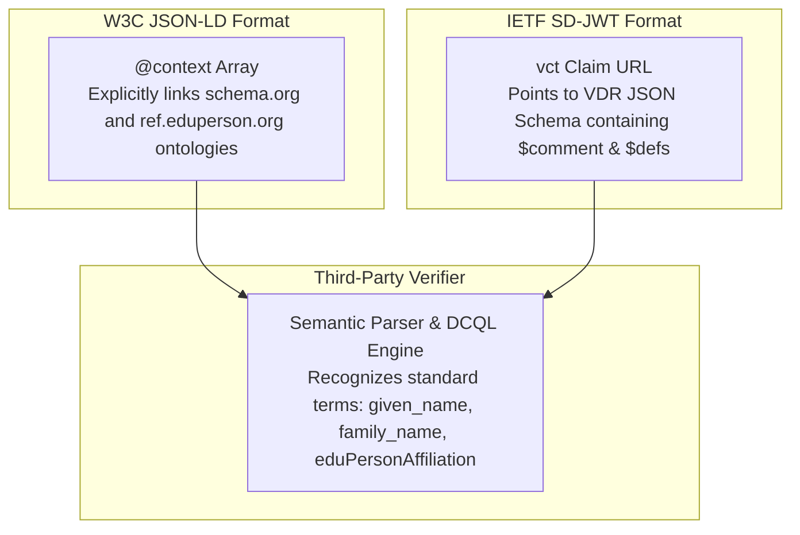
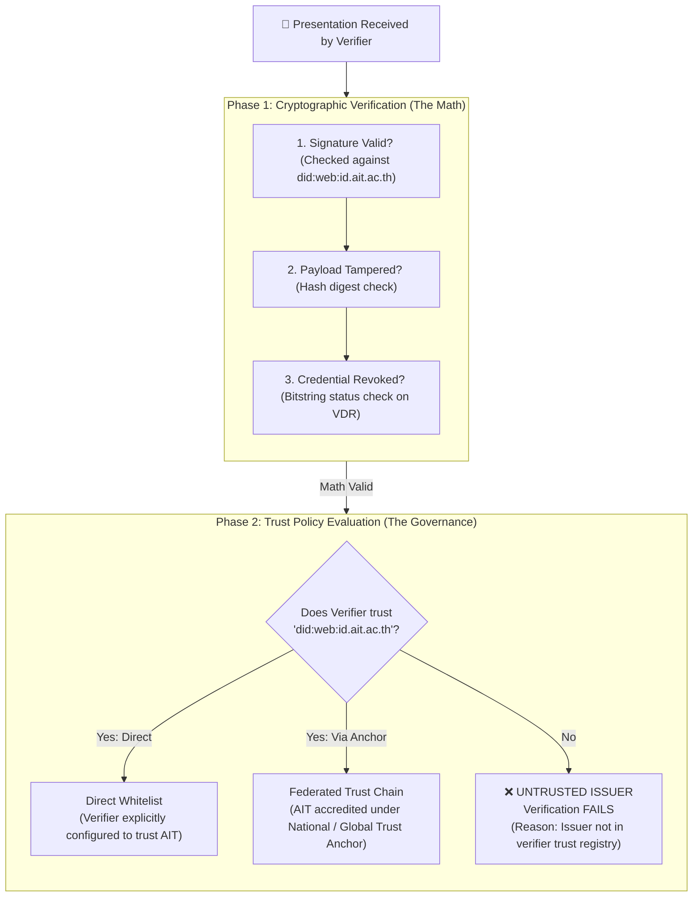
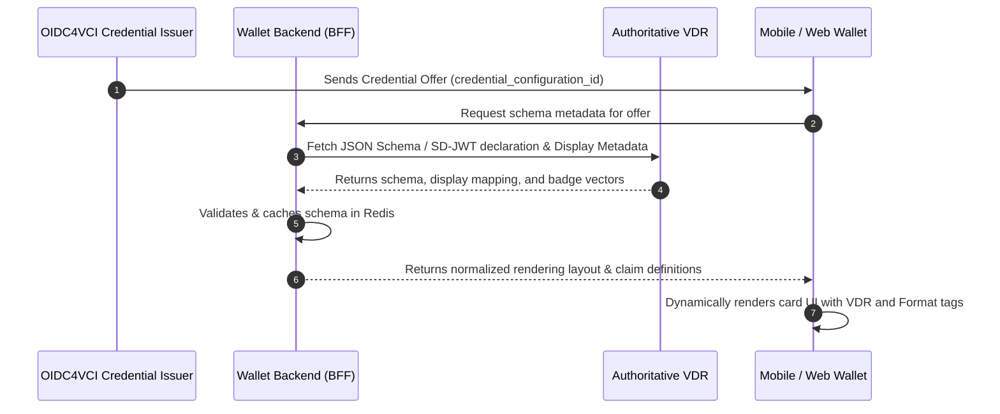

# Global Standards & Verifiable Data Registries (VDR)

---

## 🌐 1. Architectural Principle: Why Schemas Belong to VDRs, Not the Wallet

A foundational principle of decentralized identity is the **strict separation of schema ownership from wallet software**:

- **The Wallet Does Not Own Schemas**: The wallet is an agnostic, privacy-preserving cryptographic container and presentation client. It does not hardcode data models for Student IDs, Staff IDs, National IDs, or Academic Transcripts.
- **Schemas Belong to VCGAs and VDRs**: Governance Authorities (VCGAs) define legal schema specifications and publish them to public **Verifiable Data Registries (VDRs)**.
- **Dynamic Runtime Resolution**: When an issuer offers a credential via **OpenID for Verifiable Credential Issuance (OIDC4VCI)**, the wallet's **Backend (BFF / Inji Mimoto)** queries the authoritative VDR, validates the schema, caches metadata, and provides the client with display instructions.

By avoiding hardcoded credential schemas inside this repository, the wallet remains permanently decoupled from schema version churn and can support new credential types across borders without client updates.

---

## 🏛️ 2. Semantic Foundation: Modeling Institutional IDs on `schema.org` & `eduPerson`

To ensure institutional credentials (such as **AIT Student ID** and **AIT Staff ID**) are globally interoperable and understood by third-party verifiers, credentials must declare that they model their claims on established global ontologies: **`schema.org`** and **`eduPerson`** (RFC 8485 / REF eduPerson).

### 2.1 How Verifiers Discover the Ontology Mapping



#### A. In W3C JSON-LD: The `@context` Semantic Array
The credential declares its semantic vocabulary directly in the JSON-LD `@context`. When a verifier dereferences these URLs, it unambiguously maps each field to international RDF ontology terms:

```json
{
  "@context": [
    "https://www.w3.org/ns/credentials/v2",
    "https://schema.org",
    "https://ref.eduperson.org/context/v1",
    "https://id.ait.ac.th/vdr/schemas/student-id/v1.jsonld"
  ],
  "id": "urn:uuid:f81d4fae-7dec-11d0-a765-00a0c91e6bf6",
  "type": ["VerifiableCredential", "StudentCredential"],
  "issuer": "did:web:id.ait.ac.th",
  "credentialSubject": {
    "givenName": "Somchai",
    "familyName": "Jaidee",
    "eduPersonAffiliation": "student",
    "eduPersonScopedAffiliation": "student@ait.ac.th",
    "memberOf": {
      "@type": "EducationalOrganization",
      "name": "Asian Institute of Technology",
      "identifier": "did:web:id.ait.ac.th"
    }
  }
}
```

#### B. In IETF SD-JWT: The `vct` & VDR JSON Schema Declaration
SD-JWT credentials utilize a **`vct` (Verifiable Credential Type)** URI that points to the schema published on AIT's public VDR. The VDR schema explicitly annotates the global mappings:

##### 1. Inside the SD-JWT Payload:
```json
{
  "iss": "https://id.ait.ac.th",
  "vct": "https://id.ait.ac.th/vdr/schemas/student-id/v1.json",
  "given_name": "Somchai",
  "family_name": "Jaidee",
  "affiliation": "student",
  "organization_id": "did:web:id.ait.ac.th"
}
```

##### 2. Inside the VDR Schema (`https://id.ait.ac.th/vdr/schemas/student-id/v1.json`):
```json
{
  "$schema": "https://json-schema.org/draft/2020-12/schema",
  "$id": "https://id.ait.ac.th/vdr/schemas/student-id/v1.json",
  "title": "AIT Student Credential",
  "description": "Student identity credential modeled after schema.org/Person and eduPerson standards.",
  "type": "object",
  "properties": {
    "given_name": {
      "type": "string",
      "description": "Legal first name",
      "$comment": "Maps to schema.org/givenName"
    },
    "family_name": {
      "type": "string",
      "description": "Legal last name",
      "$comment": "Maps to schema.org/familyName"
    },
    "affiliation": {
      "type": "string",
      "enum": ["student"],
      "$comment": "Maps to eduPersonAffiliation (RFC 8485 / REF eduPerson)"
    },
    "organization_id": {
      "type": "string",
      "format": "uri",
      "$comment": "Maps to schema.org/EducationalOrganization identifier"
    }
  }
}
```

---

## 🆔 3. Target Archetype 1: National Digital ID (PID)

The foundational credential for verifying individual identity across public and commercial services is the **Person Identification Data (PID)**.

### Applicable Global & Regional Standards
| Standard Body | Specification | Format & Profile | Primary Capability |
| :--- | :--- | :--- | :--- |
| **ISO / IEC** | **ISO/IEC 18013-5 & ISO/IEC 23220** | `mso_mdoc` (CBOR) | Offline proximity NFC tap at turnstiles, transit gates, and border checkpoints. |
| **IETF / OpenID** | **eIDAS 2.0 ARF / OpenID4VP PID Profile** | `vc+sd-jwt` | Attribute-level selective disclosure over dynamic QR codes and online web portals. |
| **W3C** | **W3C VC Data Model v2.0** | `ldp_vc` (JSON-LD) | Semantic Linked Data interoperability across national registries. |

### Standard Canonical PID Claims (Resolved from VDR)
```json
{
  "family_name": "Jaidee",
  "given_name": "Somchai",
  "birth_date": "2000-01-15",
  "national_id_number": "1-xxxx-xxxxx-xx-x",
  "issuing_country": "TH",
  "issuing_authority": "Department of Provincial Administration",
  "issuance_date": "2024-01-01T00:00:00Z",
  "expiry_date": "2032-01-01T00:00:00Z"
}
```

### VDR Resolution Endpoints
- **Thailand National VDR**: `https://vdr.thailand.gov.th/schemas/pid/v1`
- **India National Registry (DigiLocker / UIDAI)**: `https://digilocker.gov.in/vdr/schemas/aadhaar/v1`

---

## 🎓 4. Target Archetype 2: University Academic Transcript

The definitive credential for higher education progress and graduation conferral is the **Verifiable Academic Transcript**.

### 4.1 Core Principle: Interoperability vs. Trust are Different Problems

> [!IMPORTANT]
> **Interoperability and Trust are two completely independent architectural layers:**
> 1. **Interoperability (Syntax & Semantics)**: *"Can the verifier's software read, parse, and understand the transcript?"*
>    - As long as the transcript is modeled on global **`schema.org`** and standard VC profiles, **semantic interoperability is guaranteed**. Any system in the world can parse the student name, GPA, courses, and conferral date without custom code.
>    - **The Responsibility Boundary**: It is the **Issuer's responsibility** to model credentials strictly against international standards. If a third-party verifier builds a non-standard or proprietary parser that fails to read standard-compliant data, that is a **verifier defect**, not an issuer failure.
> 2. **Trust (Governance & Authority)**: *"Does the verifier trust that AIT has the legal accreditation to issue this degree?"*
>    - This is an independent governance/policy check. Even a perfectly formatted, 100% interoperable transcript will be rejected if the verifier does not trust the issuing institution. Trust is achieved via VDR trust chains (see Section 5).

### 4.2 Applicable Global Standards & Schema.org Ontologies
| Standard / Ontology | Specification / Model | How It is Applied to the Transcript |
| :--- | :--- | :--- |
| **`schema.org/EducationalOccupationalCredential`** | Core W3C / Schema.org vocabulary | Defines the qualification, degree level (`credentialCategory`), granting body (`recognizedBy`), and conferral date. |
| **`schema.org/Course`** | Course definitions & achievements | Represents each completed course, course code, credit weight (`numberOfCredits`), and awarded grade. |
| **`schema.org/EducationalOccupationalProgram`** | Academic study curriculum | Models the academic major, study department, and university school. |
| **1EdTech CLR 2.0 / Open Badges 3.0** | Comprehensive Learner Record | W3C JSON-LD profile linking courses, skills, and credentials into a verifiable academic record. |
| **European Learning Model (ELM v3)** | Formal Higher Ed Data Model | Standardized European diploma supplement mapping (ECTS credits and grading tables). |
| **IETF SD-JWT Higher Education Profile** | `vc+sd-jwt` | Privacy-preserving disclosure: allows students to disclose degree conferral while redacting individual grades, or prove a GPA threshold. |

### 4.3 Semantic Claim Mapping (Resolved from VDR)

| Transcript Claim | Semantic Ontology Mapping | Description |
| :--- | :--- | :--- |
| `transcript_id` | `schema.org/identifier` | Unique serial number of the issued transcript |
| `student_id` | `schema.org/identifier` | Institutional student matriculation number |
| `full_name` | `schema.org/name` | Full legal name of the student / alumnus |
| `institution_name` | `schema.org/EducationalOrganization/name` | Legal name of the issuing university |
| `institution_id` | `schema.org/EducationalOrganization/identifier` | Authoritative DID (e.g. `did:web:id.ait.ac.th`) |
| `program_name` | `schema.org/EducationalOccupationalProgram/name` | Degree program (e.g. Computer Science) |
| `degree_name` | `schema.org/EducationalOccupationalCredential/name` | Awarded degree title (e.g. Master of Engineering) |
| `academic_status` | `schema.org/status` | `IN_PROGRESS` (current student) vs. `CONFERRED` (alumnus) |
| `conferral_date` | `schema.org/dateCreated` | Official graduation or conferral date |
| `cumulative_gpa` | `schema.org/aggregateRating` | Cumulative Grade Point Average |
| `courses` | Array of `schema.org/Course` | Itemized course records (`course_code`, `course_title`, `credits`, `grade`) |

### Standard Canonical Transcript Claims (Resolved from VDR)
```json
{
  "transcript_id": "AIT-TR-2026-99214",
  "student_id": "st125088",
  "full_name": "Somchai Jaidee",
  "institution_name": "Asian Institute of Technology",
  "institution_id": "did:web:id.ait.ac.th",
  "program_name": "Computer Science",
  "degree_name": "Master of Engineering",
  "academic_status": "CONFERRED",
  "conferral_date": "2026-05-18",
  "cumulative_gpa": 3.85,
  "gpa_scale": 4.0,
  "total_credits": 36,
  "courses": [
    {
      "course_code": "CS72.01",
      "course_title": "Distributed Systems and Cloud Computing",
      "credits": 3,
      "grade": "A"
    },
    {
      "course_code": "CS72.42",
      "course_title": "Decentralized Identity and Cryptographic Protocols",
      "credits": 3,
      "grade": "A"
    }
  ]
}
```

### 4.4 Semantic Inheritance & Dual-Context Architecture: Global Standards vs. National Extensions

#### The "Walled Garden" Risk of Proprietary National Schemas
If a national regulatory authority (such as Thailand's Ministry of Higher Education, Science, Research and Innovation - MHESI, or a national digital agency) establishes a localized or proprietary transcript schema without aligning with global ontologies:
- **International Mobility Breaks**: Graduates moving abroad to Europe, North America, or Japan find that foreign verifiers, HR platforms, and credential evaluation services (e.g., WES) cannot parse or understand domestic, proprietary fields.
- **The Institutional Dilemma**: An international postgraduate institute like AIT (chartered internationally but operating in Thailand) cannot compromise global portability for domestic compliance, nor ignore local host-nation regulations.

#### The Architectural Solution: Semantic Inheritance & Dual-Contexts
Decentralized identity architectures solve this dilemma through **Semantic Inheritance and Multi-Context Grounding**:
1. **Universal Base Layer (`schema.org`)**: The core educational claims (`name`, `credentialCategory`, `educationalLevel`, `hasCourseSpecification`, `gradingScale`, `creditsEarned`) map strictly to global `schema.org` ontologies.
2. **National Extension Layer**: Country-specific regulatory identifiers (e.g., Thai Ministry curriculum codes, national civil identification mappings) are namespaced under a secondary national context.

#### Canonical Dual-Context Payload Example (W3C JSON-LD)
```json
{
  "@context": [
    "https://www.w3.org/ns/credentials/v2",
    "https://schema.org",
    "https://schema.mhesi.go.th/v1",
    "https://id.ait.ac.th/vdr/schemas/transcript/v1.jsonld"
  ],
  "id": "urn:uuid:8b3e34b1-8b92-4217-9154-e034e320d3f2",
  "type": [
    "VerifiableCredential",
    "EducationalOccupationalCredential",
    "ThaiUniversityTranscript"
  ],
  "issuer": "did:web:id.ait.ac.th",
  "credentialSubject": {
    "id": "did:key:z6MkpTHR8VNsBxYAAWHut2Geadd9jSwuBV8xRoAnwWsdvktH",
    "name": "Somchai Jaidee",
    "credentialCategory": "degree",
    "educationalLevel": "MasterOfScience",

    // Universal Global Claims (Understood by any verifier in the world via schema.org)
    "hasCourseSpecification": [
      {
        "@type": "Course",
        "courseCode": "CS72.01",
        "name": "Distributed Systems and Cloud Computing",
        "numberOfCredits": 3,
        "grade": "A"
      },
      {
        "@type": "Course",
        "courseCode": "CS72.42",
        "name": "Decentralized Identity and Cryptographic Protocols",
        "numberOfCredits": 3,
        "grade": "A"
      }
    ],

    // National Extension Namespace (Only parsed by domestic Thai verifiers / regulators)
    "thaiCurriculumCode": "1002564001",
    "thaiMinistryAccreditationRef": "MHESI-04-2026-AIT",
    "thaiNationalStudentId": "1-1004-99821-12-3"
  }
}
```

#### How Verifiers Consume Dual-Context Credentials
- **Global Verifiers (International Employers & Overseas Graduate Schools)**:
  - The verifier's Linked Data parser resolves `https://schema.org`.
  - It successfully extracts and displays the student's courses, credit hours, grades, degree conferral, and honors.
  - Per W3C Linked Data and JSON processing rules, unfamiliar localized extensions (`thaiCurriculumCode`) are safely ignored without throwing validation errors.
  - **Result**: Global mobility and automated processing remain 100% intact.
- **Domestic Verifiers (Thai Civil Service & National Accreditation Boards)**:
  - The verifier resolves both `schema.org` and `https://schema.mhesi.go.th/v1`.
  - It validates both the universal academic achievements and the mandatory national curriculum identifiers.
  - **Result**: Complete regulatory compliance with zero custom branch forks.

---

## 🔒 5. Trust Frameworks: What Happens If a Verifier Doesn't Trust AIT VDR?

When a verifier checks a credential presented by a user, verification occurs across **two distinct phases**:



### 1. Does the Verification Fail if AIT VDR is Untrusted?
**Yes, at Phase 2 (Policy Evaluation).**
- Even if the cryptographic signature is 100% mathematically valid and unrevoked, if the relying party has a policy that says: *"I only accept degrees from universities on my accepted list"*, and AIT is not on that list, the verifier software rejects the credential as **"Cryptographically Valid but Untrusted Issuer"**.
- This is by design: decentralized identity prevents any rogue entity from creating a domain (`did:web:fake-university.com`), signing a transcript, and forcing third parties to accept it.

---

### 2. How Trust Federation Solves This (The Federation Chain)

To prevent AIT from needing a bilateral business contract with every employer and university in the world, AIT connects to **Federated Trust Registries (OpenID Federation 1.0 / eIDAS)**:


1. **The Trust Anchor**: The relying party (e.g. an employer or international university) configures its verifier to trust the **National Trust Anchor** (e.g. Thailand Ministry of Higher Education) or an international academic consortium (e.g. **eduGAIN / GÉANT**).
2. **Subordinate Statements**: The Trust Anchor publishes a signed Entity Statement asserting that `did:web:id.ait.ac.th` is an accredited, legitimate higher education institution.
3. **Automated Verification**: When the student presents their credential, the verifier resolves the trust chain up to the Anchor. **Verification succeeds automatically** without the verifier ever having heard of AIT beforehand.

---

## ⚙️ 6. Dynamic Schema Resolution & Rendering Engine



1. **Zero Client Hardcoding**: The client app maintains no internal schema registries. It relies on standard **OIDC4VCI Credential Display Metadata** (`display`, `logo`, `background_color`, `text_color`).
2. **Offline Schema Caching**: The BFF caches resolved VDR schemas and display properties, enabling thin clients to validate and present credentials even during intermittent network connectivity.
3. **Multi-Format Auto-Binding**: If the VDR indicates that a transcript or ID is available in both `vc+sd-jwt` and `mso_mdoc`, the wallet binds both formats under the same visual card tag structure.
