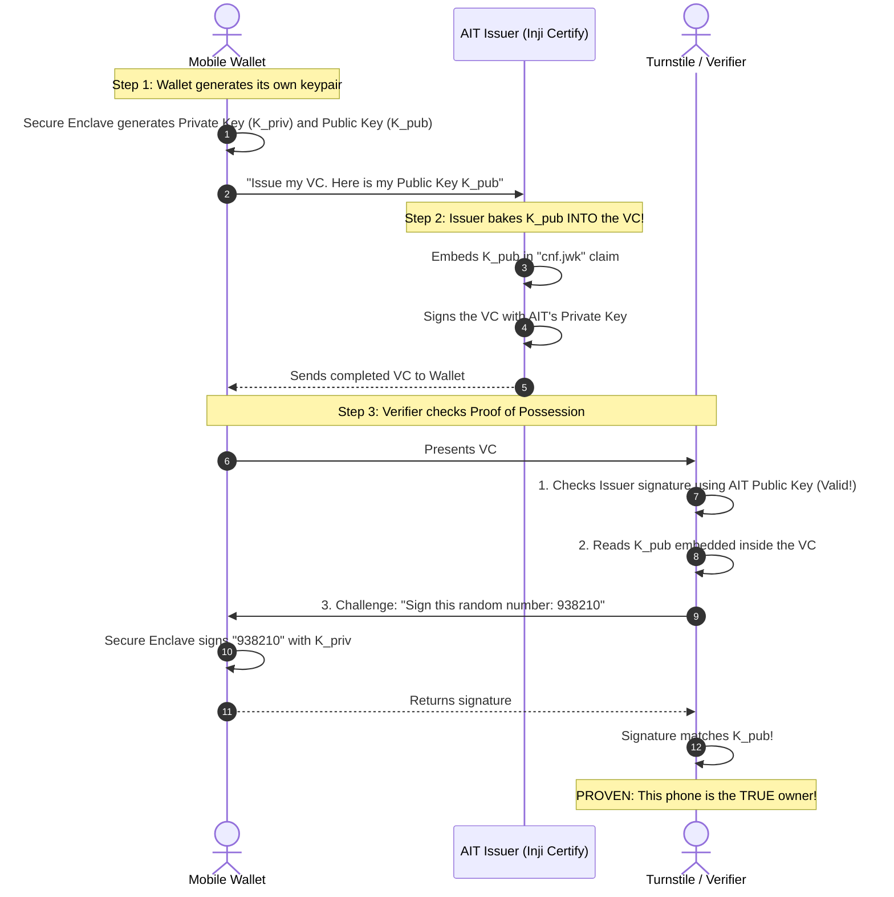

# Verifiable Credentials & Decentralized Identity: AIT Learning Guide

This document is an introductory and conceptual guide for anyone joining the **AIT Wallet** project. It explains the core cryptographic concepts, trust architectures, and design patterns used across our ecosystem in plain, practical terms.

---

## 📚 Table of Contents

1. [The Big Picture: The Triangle of Trust](#1-the-big-picture-the-triangle-of-trust)
2. [VCGA vs. VDR: Governance and Registries](#2-vcga-vs-vdr-governance-and-registries)
3. [The "Secret Sauce": Holder Binding & Proof of Possession](#3-the-secret-sauce-holder-binding--proof-of-possession)
4. [Digital VCs vs. Physical Paper VCs with QR Codes](#4-digital-vcs-vs-physical-paper-vcs-with-qr-codes)
5. [Privacy & Selective Disclosure (SD-JWT)](#5-privacy--selective-disclosure-sd-jwt)
6. [Universal Interoperability & Contextual PIDs](#6-universal-interoperability--contextual-pids)
7. [Account Architecture: Registered Mode vs. Guest Mode](#7-account-architecture-registered-mode-vs-guest-mode)
8. [Thin Mobile Client vs. Thick Wallet Backend](#8-thin-mobile-client-vs-thick-wallet-backend)
9. [Jargon Buster & Glossary](#9-jargon-buster--glossary)

---

## 1. The Big Picture: The Triangle of Trust

In traditional IT systems, if a student wants to prove their enrolled status to the campus library or a future employer, the library or employer has to call AIT's central database directly via an API.

In decentralized identity, we use the **Triangle of Trust**:

```mermaid
flowchart TD
    Issuer["🏛️ Issuer\n(AIT Registrar / HR)"]
    Holder["📱 Holder\n(Student / Mobile Wallet)"]
    Verifier["🔍 Verifier\n(Library Gate / Employer)"]
    VDR["📖 Verifiable Data Registry (VDR)\n(Public Keys & Status Lists)"]

    Issuer -->|1. Issues VC (OIDC4VCI)| Holder
    Holder -->|2. Presents VP (OIDC4VP)| Verifier
    Verifier -->|3. Resolves Public Keys & Status| VDR
    Issuer -->|Publishes Keys & Status Lists| VDR
```

1. **Issuer (AIT)**: Creates and cryptographically signs the credential once, then gives it to the Holder.
2. **Holder (Student/Staff)**: Stores the credential in their mobile wallet's hardware-encrypted storage.
3. **Verifier (Library/Employer)**: Checks the credential without needing direct access to AIT's private databases. They verify the signature against AIT's public keys published in the VDR.

---

## 2. VCGA vs. VDR: Governance and Registries

These two terms are fundamental across global decentralized identity trust frameworks (such as W3C, ToIP, and Thailand):

### VCGA (Verifiable Credential Governance Authority)
The **VCGA is the rule-maker (the policy and legal authority)**.
- At AIT, the **AIT VCGA** decides:
  - Which credentials are considered official **PIDs** (`AIT Student ID`, `AIT Faculty ID`, `AIT Staff ID`).
  - Who is authorized to sign them (e.g. only the Office of the Registrar can sign academic transcripts).
  - The business rules for revoking credentials.

### VDR (Verifiable Data Registry)
The **VDR is the public technical phonebook and status board**.
It performs **4 essential jobs**:
1. **Public Key Directory**: Hosts AIT's public keys (`did:web:id.ait.ac.th`) so anyone can verify signatures.
2. **Credential Status Lists**: Hosts anonymous bit arrays (e.g. W3C Bitstring Status Lists) to check if a VC is `Active` or `Revoked`.
3. **Schema Registry**: Hosts official schema templates so verifiers know what fields exist.
4. **Trust List**: Lists accredited issuers recognized by the VCGA.

> 💡 **Core Privacy Rule: The VDR Does NOT Know Who Owns What!**  
> The VDR does **not** store records like *"Wallet #123 owns Student ID st125088"*. If it did, anyone snooping on the VDR could track all students. The VDR only publishes anonymous mathematical validation data (public keys, schemas, and status bits).

---

## 3. The "Secret Sauce": Holder Binding & Proof of Possession

*Question: If the VDR doesn't know who owns the VC, why can't a student just AirDrop or screenshot their Student ID to a friend?*

Because of **Holder Binding** (also called **Key Binding**):



### The 3 Verification Checks
When any verifier examines a VC, it performs three distinct checks:
1. **Check 1: Issuer Signature Check** $\rightarrow$ Uses AIT's public key from the VDR. Proves the VC is genuinely from AIT and has not been altered.
2. **Check 2: Content Inspection** $\rightarrow$ Reads the wallet's public key (`cnf.jwk`) baked inside the credential payload.
3. **Check 3: Proof of Possession (The Live Handshake)** $\rightarrow$ Asks the phone to sign a one-time random challenge. If a friend was sent a copy of the VC, their phone does not have the original student's private key locked in their hardware chip, so Check 3 fails immediately.

---

## 4. Digital VCs vs. Physical Paper VCs with QR Codes

Verifiable Credentials can exist in two forms:

| Aspect | 📱 Digital VC (In Mobile Wallet) | 📄 Physical VC (Paper / Diploma with QR) |
| :--- | :--- | :--- |
| **Where it lives** | Phone's hardware chip (Secure Enclave) | Printed on diploma, plastic card, or paper |
| **Holder Binding** | **Bound to device key** (`cnf.jwk`) | **Unbound (Bearer token)** |
| **Tamper Resistance** | Cryptographic digital signature | Cryptographic QR code signature |
| **Anti-Sharing Defense** | Hardware-level mathematical handshake | **Manual inspection** (Checking printed photo/ID) |
| **Speed** | Sub-second automated turnstile scan | Human inspection or kiosk camera scan |

> **Real-World Takeaway**: An official printed AIT transcript can have a cryptographic QR code on it. Anyone scanning it can mathematically verify that AIT issued it and the grades weren't forged. But to prove the bearer is the actual student, human inspection (comparing passport photo/name) is required. On a mobile phone, that proof is automatic and instant.

---

## 5. Privacy & Selective Disclosure (SD-JWT)

Traditional physical plastic cards or static PDFs force **all-or-nothing disclosure**:
- Showing your ID to enter a campus event reveals your full name, student ID, birth date, home address, and photo.

With **IETF SD-JWT (Selective Disclosure JWT)**, individual claims are salted and hashed separately:

```text
┌────────────────────────────────────────────────────────┐
│             Full Credential (In Wallet)                │
│  • Full Name: Somchai Jaidee                           │
│  • Degree: Master of Engineering                       │
│  • GPA: 3.85                                           │
│  • Enrollment Status: ACTIVE                           │
│  • Citizen ID: 1-2345-67890-12-3                       │
└───────────────────────────┬────────────────────────────┘
                            │
            ┌───────────────┴───────────────┐
            ▼                               ▼
  [ Library Turnstile ]            [ Employer Verification ]
  Discloses ONLY:                  Discloses ONLY:
  • Status: ACTIVE                 • Full Name: Somchai Jaidee
  (Hides GPA & Citizen ID)         • Degree: Master of Engineering
                                   • GPA: 3.85
                                   (Hides Citizen ID)
```

The verifier can mathematically verify that the disclosed claims were genuinely signed by AIT without ever seeing the hidden claims.

---

## 6. Universal Interoperability & Contextual PIDs

A core design principle of decentralized identity is: **The wallet does not hardcode what a PID is. A PID is defined by a Governance Authority (VCGA) and requested by a Verifier.**

- **The Wallet Doesn't Care**: To the wallet, a VC is simply a cryptographically signed payload. It can hold an AIT Student ID, a Thai National Digital ID, an Indian Aadhaar, or an Indonesian identity card with equal ease.
- **Contextual PID**: 
  - Within AIT's governance domain, the AIT VCGA designates Student, Faculty, and Staff IDs as campus PIDs.
  - Within Thailand's governance domain, the Thai National ID is designated as the national PID.
  - The verifier simply specifies which PID it requires, and the wallet presents it.

> 🎛️ **The UI Context Selector (Presentation Layer Only)**:  
> Because users move between environments (e.g. living in Thailand, studying at AIT, traveling to India), the wallet allows selecting a **Default VCGA / Region** (just like picking an app language).  
> - If set to **AIT Campus** $\rightarrow$ the AIT Student ID is pinned and highlighted at the top of the home card deck.  
> - If set to **Thailand** $\rightarrow$ the Thai National ID is pinned and highlighted.  
> Functionality-wise, nothing changes under the hood: this is purely a visual convenience for the human user.

### Connecting Multiple Registries (The Federated VDR Pattern)
When scaling to recognize credentials from diverse national registries like **Thailand**, **India (DigiLocker / Aadhaar)**, **Japan**, or **Indonesia (INA Digital)**, we use a **Backend Federated VDR**:

```text
┌─────────────────┐       ┌─────────────────┐       ┌─────────────────┐
│    Thailand     │       │India(DigiLocker)│       │ Japan / Indo    │
└────────┬────────┘       └────────┬────────┘       └────────┬────────┘
         │                         │                         │
         └────────────────► ┌──────▼────────┐ ◄──────────────┘
                            │    AIT VDR    │ (Trust Hub / Federation Anchor)
                            │ (VCGA Server) │
                            └──────┬────────┘
                                   │ Single Standard Endpoint
                                   ▼
                            ┌───────────────┐
                            │  AIT Wallet   │
                            └───────────────┘
```

* **Why this is better**: You never have to submit an app update to the Apple App Store or Google Play Store just to support a new country. AIT administrators simply add the new country's trust anchor to the backend VDR.

---

## 7. Account Architecture: Tiered Model (Guest to Permanent)

To ensure zero friction for new installs while providing robust long-term security and cost control:

```text
                            AIT Mobile Wallet App
                                      │
                                      ▼
                        [ Fresh Mobile Installation ]
                                      │
                                      ▼
            ┌──────────────────────────────────────────────────┐
            │   TIER 1: TEMPORARY GUEST ACCOUNT (Mobile Only)  │
            ├──────────────────────────────────────────────────┤
            │ • Auto-activated on mobile launch (Web excluded) │
            │ • Ephemeral local keys (No registration needed)  │
            │ • Auto-purged after 30 days of inactivity        │
            │ • ⚠️ Data loss warning modal on claiming any VC  │
            │ • 🚫 STRICT POLICY GUARD: Cannot claim PID VCs   │
            │ • Holds single-use vouchers, meal & Wi-Fi passes │
            └─────────────────────────┬────────────────────────┘
                                      │
                                      ▼ (Upgrade via Google, Apple, Microsoft, or SSO)
            ┌──────────────────────────────────────────────────┐
            │  TIER 2: PERMANENT REGISTERED (Web + Mobile)     │
            ├──────────────────────────────────────────────────┤
            │ • Unlocks Web Wallet on desktop browsers         │
            │ • ✅ Unlocks claiming official PIDs & Transcripts │
            │ • Zero-Knowledge E2EE cloud backup sync          │
            │ • Multi-year retention (purged after 6 mo. idle) │
            └──────────────────────────────────────────────────┘
```

### Guest Mode & Single-Use VCs (Tier 1)
- **Zero Registration Barrier**: New mobile users (symposium visitors, parents, prospective students) instantly receive a temporary guest account.
- **Safety Boundary**: The wallet warns guests that data is local and temporary. It **strictly blocks claiming official PIDs** (Student ID or National ID) until upgraded.
- **Single-Use VCs**: Guests can hold ephemeral passes (e.g. 150 THB canteen vouchers or 1-day parking passes). When presented, the voucher's bit in the VDR status list flips to `REDEEMED`, preventing double spending.
- **Pruning**: Guest accounts inactive for **30 days** are purged to keep the client clean.

### Permanent Account (Tier 2)
- Upgrading is seamless via pluggable IdPs (Google, Apple, Microsoft, or Institutional SSO).
- Migrates existing local cryptographic keys into a zero-knowledge E2EE backup vault.
- Unlocks desktop Web Wallet and official PID claiming.
- Inactive accounts are retained up to **6 months** before automated cleanup.

---

## 8. Thin Mobile Client vs. Thick Wallet Backend

A common architectural trap in decentralized identity is trying to put every VDR adapter, DID resolver, and status parser inside the mobile app. This causes huge app sizes, battery drain, and forced App Store updates whenever a registry changes.

In the **AIT Wallet architecture**, we enforce a strict separation of concerns:

```text
┌────────────────────────────────────────────────────────┐
│               📱 Mobile App (Thin Client)              │
│  ✔ Visualization & UX (Cards, QR codes, badges)       │
│  ✔ Secure Local Storage (Encrypted DB / MMKV)          │
│  ✔ Hardware Keystore (Private keys, Face ID signing)   │
└───────────────────────────┬────────────────────────────┘
                            │ Clean REST API
                            ▼
┌────────────────────────────────────────────────────────┐
│          🖥️ Wallet Backend (BFF / Inji Mimoto)          │
│  ✔ VDR Adapter Hub (AIT, Thailand, India, Global)       │
│  ✔ Status Tracking & Bitstring Decompression           │
│  ✔ Foreign Registry Polling & Normalization            │
│  ✔ Public Key & Schema Caching                         │
└────────────────────────────────────────────────────────┘
```

- **Mobile App**: Lightweight and durable. It only cares about rendering the UI, saving the credentials locally, and using its Secure Enclave chip to sign Proof of Possession challenges.
- **Wallet Backend**: Does the heavy lifting. When the mobile app asks *"What is the status of my Thai or Indian VC?"*, the backend executes the adapter, queries the foreign registry, and returns `{ "status": "ACTIVE" }` in milliseconds.

---

## 9. Jargon Buster & Glossary

| Term | Full Name | Plain English Meaning |
| :--- | :--- | :--- |
| **VC** | Verifiable Credential | A tamper-evident digital document with cryptographic proof of authenticity (like a digital diploma or driver's license). |
| **VP** | Verifiable Presentation | A package of claims derived from one or more VCs, signed by the holder to prove ownership to a verifier. |
| **PID** | Person Identification Data | The foundational identity credential representing who you are (e.g., Student ID or Citizen ID). |
| **VDR** | Verifiable Data Registry | The public directory hosting public keys, schemas, and revocation lists. |
| **VCGA** | VC Governance Authority | The governing organization that sets rules, policies, and accreditations. |
| **BFF** | Backend-for-Frontend | The server layer (e.g. Inji Mimoto) handling heavy VDR integrations on behalf of the mobile app. |
| **OIDC4VCI** | OpenID for VC Issuance | The international API protocol a mobile phone uses to download a VC from an issuer. |
| **OIDC4VP** | OpenID for VC Presentations | The international API protocol a mobile phone uses to present a VC to a verifier. |
| **SD-JWT** | Selective Disclosure JWT | A modern token format allowing users to hide specific attributes when presenting credentials. |
| **Holder Binding** | Key Binding / PoP | The cryptographic lock binding a VC to the private key inside a specific phone's hardware chip. |
| **Bitstring** | Bitstring Status List | An ultra-compact list of `0`s and `1`s in the VDR indicating whether credentials are active or revoked. |
