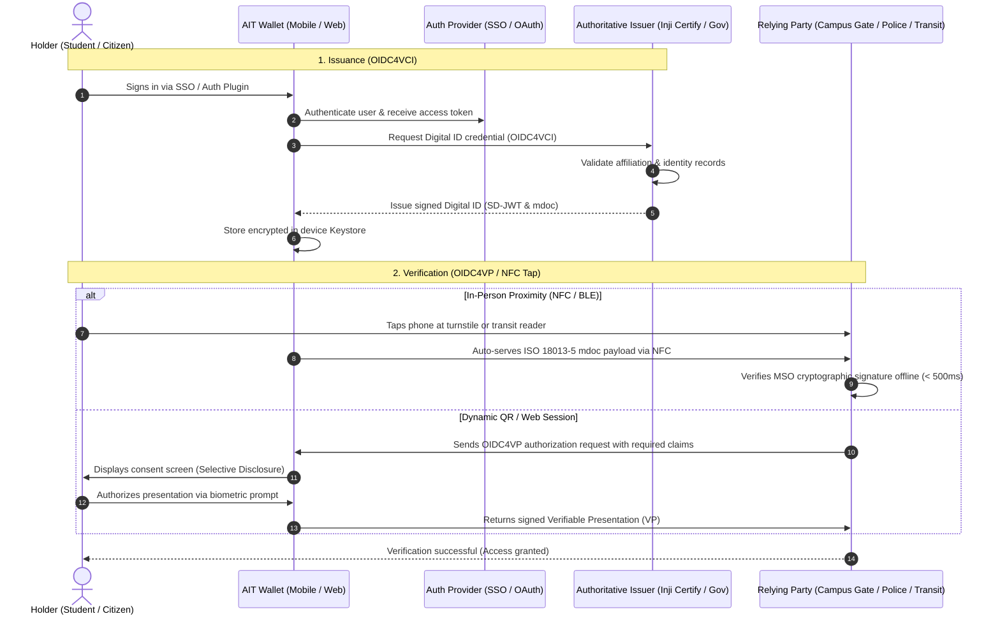
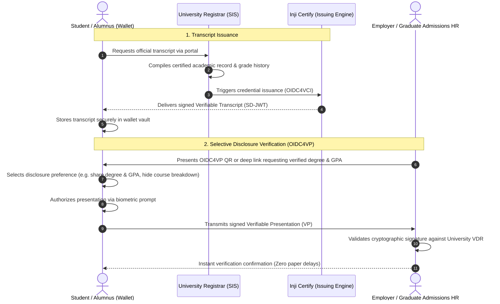

# End-to-End Use Cases — AIT Wallet

---

## 🏛️ Use Case 1: Digital Identity Verification (National ID & Campus ID)

### 1.1 Objective
Provide an instant, cryptographic proof of identity using open standards (ISO/IEC 18013-5 mdoc for physical NFC taps and IETF SD-JWT for online/QR interactions), replacing physical plastic cards for students, faculty, staff, and citizens.

### 1.2 End-to-End Verification Flow



### 1.3 Key Verification Characteristics
- **Sub-Second Proximity Tap**: Operates offline via ISO 18013-5 NFC at campus turnstiles, public transport, and secure facility gates.
- **Universal Standards Interoperability**: Resolves public keys and revocation lists dynamically against Thailand VDR, AIT VDR, or India DigiLocker without proprietary gate software.
- **Selective Disclosure**: Allows holders to prove student affiliation or age without disclosing citizen identity numbers or residential address.

---

## 🎓 Use Case 2: Verifiable Academic Transcript with Selective Disclosure

### 2.1 Objective
Provide an authoritative, tamper-proof **Digital Academic Transcript** issued directly by the university registrar. Eliminates paper notarization delays, prevents academic fraud, and enables instant cryptographic verification by employers and graduate admissions offices globally.

### 2.2 End-to-End Interaction Flow



### 2.3 Selective Disclosure Capabilities (IETF SD-JWT)
Using **IETF SD-JWT**, students maintain fine-grained sovereignty over their academic data:
1. **Degree Conferral Proof Only**: Discloses `{ "degree": "Master of Engineering", "graduationDate": "2025-05-18", "status": "CONFERRED" }` without showing individual letter grades.
2. **GPA Threshold Proof**: Proves `{ "gpa": 3.75, "gpaScale": 4.0 }` without disclosing lower marks in non-major elective courses.
3. **Comprehensive Full Transcript**: Discloses all semester terms, course codes, course titles, credit values, and letter grades for formal graduate school evaluation.

---

## 🎟️ Use Case 3: Tiered Onboarding & Guest Mode

### 3.1 Objective
Enable short-term visitors, conference attendees, and prospective students to immediately receive and redeem **ephemeral, one-time Verifiable Credentials** (meal vouchers, event badges, temporary Wi-Fi access) with zero registration friction, while establishing clear boundaries that protect sensitive identity credentials (PIDs).

### 3.2 Tiered Progression & Policy Guard

```text
┌────────────────────────────────────────────────────────────────────────┐
│ [ Fresh Mobile Install ]                                               │
│             │                                                          │
│             ▼                                                          │
│  TIER 1: TEMPORARY GUEST ACCOUNT (Mobile Only)                         │
│  • Instant 1-tap activation (no email, no password)                    │
│  • 30-day inactivity auto-purge                                        │
│  • ⚠️ Warning modal shown when claiming any credential                 │
│  • 🚫 STRICT POLICY GUARD: Cannot claim Person Identification (PID)    │
│             │                                                          │
│             ▼ (User upgrades via Google, Apple, Microsoft, or SSO)     │
│  TIER 2: PERMANENT REGISTERED ACCOUNT (Multi-Platform)                 │
│  • Unlocks Web Wallet on desktop browsers                              │
│  • ✅ Unlocks claiming official PIDs (Student ID, National ID)          │
│  • Zero-Knowledge E2EE cloud backup & multi-year retention             │
└────────────────────────────────────────────────────────────────────────┘
```

### 3.3 Guest Claim Warning UX
When a guest scans a QR code to claim an event pass or meal ticket, the wallet displays an explicit user alert:
> ⚠️ **Guest Mode Notice**: You are using a temporary Guest Account. If you delete or reinstall the app, your credentials will be permanently lost. Upgrade to a permanent account anytime to secure your wallet.

### 3.4 Strict PID Policy Guard
The mobile application **strictly blocks claiming any Person Identification Data (PID)** in Guest Mode:
- If a guest attempts to import an institutional Student ID or National Digital ID, the app presents an upgrade blocker modal:
  > 🔒 **Identity Verification Required**: Official Identity Credentials (PID) cannot be stored in a temporary guest account. Please sign in with your permanent account to claim this credential.

### 3.5 One-Time VC Lifecycle & Anti-Double-Spending
For ephemeral credentials (such as canteen meal coupons or parking vouchers):
1. **Issuance**: Issued as a signed, single-use Verifiable Credential referencing an authoritative status list in the VDR.
2. **Redemption**: When presented to a cashier terminal, the verifier validates the signature and atomically flips the bit in the VDR status list to `REDEEMED`.
3. **Replay Prevention**: Any subsequent presentation attempt is immediately rejected by the verifier as already spent.
