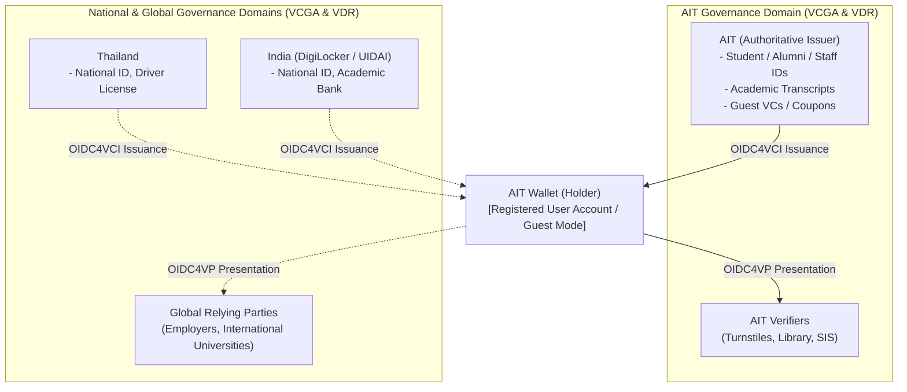
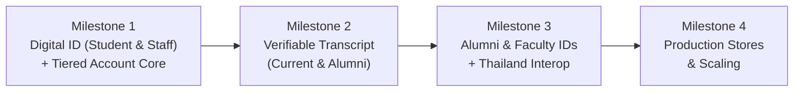

# Vision, Focus Areas & Roadmap — AIT Wallet

---

## 🌟 Executive Summary

The **AIT Wallet** is a universal decentralized digital identity and Verifiable Credential (VC) wallet. While initially deployed for the **Asian Institute of Technology (AIT)** community, it is architected on open global standards to operate across any university, national trust registry, or verifier worldwide.

The wallet acts as a neutral, privacy-preserving cryptographic container. It receives, stores, and presents credentials across diverse **Governance Authorities (VCGAs)** and **Verifiable Data Registries (VDRs)** without being locked to any single institution or geography.

---

## 🎯 Core Focus Areas

Development and roadmap milestones are concentrated strictly on two strategic tracks:

### Track 1: Digital ID (Person Identification Data - PID)
A trusted digital identity replacing physical plastic cards and providing instant cryptographic proof of affiliation:
- **Student ID**: Active matriculated students (undergraduate, master's, doctoral).
- **Alumni ID**: Graduated alumni for lifelong campus access, library privileges, and alumni network validation.
- **Faculty ID**: Academic and research professors, lecturers, and postdocs.
- **Staff ID**: Administrative, operational, laboratory, and facility staff.

> 💡 **PID is Contextual**: The wallet does not hardcode what a "PID" is. Each Governance Authority (VCGA) defines what qualifies as a PID in its domain (e.g., AIT Student ID under AIT; Thai National Digital ID under Thailand; Aadhaar under India). The wallet holds whichever credentials the user imports and presents whichever PID the verifier requests.

### Track 2: Verifiable Academic Transcript
A tamper-proof digital academic transcript issued directly by the AIT Office of the Registrar:
- **Current Students**: Real-time progress transcripts, completed semester course grades, active GPA, and accumulated credits for scholarship, exchange program, or internship applications.
- **Alumni**: Official conferred degree transcripts, graduation honors, and academic records for employer verification, graduate school admissions, or visa applications, eliminating paper notarization delays.

---

## 🌐 Multi-Governance & Universal Interoperability

1. **AIT as Initial Reference Issuer**: AIT provides the initial deployment and pilot testbed for campus life and academic credentials.
2. **Universal Standards Native**: Because the wallet strictly implements **W3C Verifiable Credentials**, **IETF SD-JWT**, and **ISO 18013-5 mdoc**, credentials held in the wallet are mathematically verifiable by any relying party anywhere in the world.

---

## 👤 Tiered Account Architecture: Guest to Permanent Upgrade
 
To serve both the temporary campus visitors and the permanent community while protecting sensitive identity data and managing cloud costs, the wallet provides a progressive two-tier account architecture:
 
### 1. Tier 1: Temporary Guest Account (Mobile Only)
- **Target**: Campus visitors, symposium delegates, parents, prospective students.
- **Zero Registration**: Instant auto-activation on fresh mobile launch (desktop web excluded).
- **Policy Guard & Warnings**: Displays data loss warning when claiming any VC; strictly blocks claiming any Person Identification Data (PID).
- **Use Cases (Single-Use Passes & Vouchers)**:
- **Visitor Day Pass**: One-day entry pass to campus grounds and events.
- **Canteen & Event Coupons**: One-time digital vouchers issued for conferences or campus food festivals.
- **Guest Wi-Fi Voucher**: Cryptographic credential authorizing temporary campus network access.
- **Visitor Parking Pass**: Single-day parking authorization.
- **Retention**: Auto-purged after **30 days** of inactivity.

### 2. Tier 2: Permanent Registered Account (Multi-Platform)
- **Target**: Students, Alumni, Faculty, Staff, and verified public users.
- **Pluggable IdP Binding**: Authenticated via Google OAuth, Apple ID, Microsoft Entra ID, or Institutional SSO (Keycloak).
- **Full Capabilities**:
- Claim, store, and present official foundational PIDs (Student, Alumni, Faculty, Staff, National ID).
- Receive and update official Verifiable Transcripts.
- Multi-platform access (iOS, Android, and Desktop Web Wallet).
- Zero-Knowledge E2EE cloud backup and recovery across devices.
- **Retention**: Multi-year lifespan; inactive accounts pruned after **6 months** of continuous inactivity to control cloud storage overhead.

---

## 🗓️ Roadmap & Milestones

### Milestone 1: Digital ID & Tiered Account Foundation
- [ ] Initialize mobile wallet based on Inji Mobile framework.
- [ ] Implement **Tiered Account Architecture**: Tier 1 Temporary Guest (Mobile Only, 30-day inactivity, PID block) and Tier 2 Permanent Registered (Pluggable IdPs: Google, Apple, Microsoft, SSO).
- [ ] Support **AIT Student ID** and **Staff ID** issuance from AIT Inji Certify.
- [ ] Support **Tier 1 One-Time VCs** (e.g. event coupon / visitor pass).
- [ ] Implement basic VC lifecycle: Issuance (OIDC4VCI), Presentation (OIDC4VP / QR), and local secure storage.

### Milestone 2: Verifiable Transcript for Current Students & Alumni
- [ ] Define and implement standard **Academic Transcript VC Schema** aligned with Thailand national guidelines.
- [ ] Integrate AIT Registrar / Student Information System (SIS) with Inji Certify.
- [ ] Enable current students to request and receive up-to-date semester transcripts.
- [ ] Enable alumni to claim finalized, tamper-evident degree transcripts.
- [ ] Implement selective disclosure (SD-JWT) allowing students/alumni to share specific course marks or only degree verification.

### Milestone 3: Complete PID Suite & Thailand Trust Interoperability
- [ ] Expand Digital ID to support **Alumni ID** and **Faculty ID**.
- [ ] Ensure full compliance with Thailand digital credential guidelines:
  - National schema conformity.
  - Signature schemes (ECDSA Secp256r1, Ed25519) and hash algorithms.
  - Status list revocation verification.
- [ ] Pilot external verification testing with Thai relying parties / mock employers.

### Milestone 4: Production Store Launch & Scaling
- [ ] Production deployment on **Apple App Store** and **Google Play Store**.
- [ ] Security audit and penetration testing (hardware keystore, biometric protection, transport security).
- [ ] Onboarding campaigns targeting **1,000+ active users per semester** at AIT.
- [ ] Future evaluation of Web Wallet companion and submodule decoupling.
