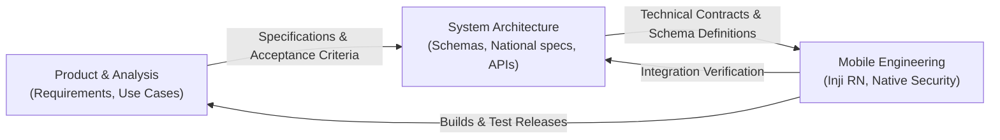

# Development Workflow & Contribution Guidelines

---

## 🛠️ 1. Collaborative Development Model

The AIT Wallet project brings together cross-functional contributors across Product/Business Analysis, System Architecture, and Mobile Engineering to deliver a production-grade decentralized identity application.



### Functional Responsibilities
- **Product & Analysis**: Formulate user requirements, user stories, and acceptance criteria for campus digital identity, academic transcripts, and guest coupons.
- **System Architecture**: Model data schemas, verify compliance with Thailand national standards, specify OIDC4VCI/OIDC4VP exchange flows, and oversee security/cryptographic protocols.
- **Mobile Engineering**: Implement client logic, manage hardware keystore integrations, style AIT design tokens, optimize performance, and oversee App Store / Play Store release pipelines.

---

## 🌿 2. Git Branching Strategy

To maintain a reliable and auditable codebase:

```text
main (Production / Stable Releases)
  ▲
  │ (Release PR / Version Tags: v0.1.0, v1.0.0)
develop (Active Integration Branch)
  ▲
  ├── feature/student-pid-issuance
  ├── feature/transcript-sd-jwt
  ├── feature/guest-mode-coupons
  ├── adapter/vdr-thailand
  └── fix/keystore-biometrics
```

### Branch Conventions
- `feature/<name>`: New mobile features, screens, or components.
- `adapter/<name>`: VDR registry adapter additions or revisions.
- `docs/<name>`: Architectural, regulatory, or use-case documentation.
- `fix/<name>`: Bug fixes and performance adjustments.
- `release/vX.Y.Z`: Release candidates for staging and store submissions.

### Commit Guidelines
Adhere to the Conventional Commits format:
- `feat(mobile): add guest mode onboarding screen`
- `feat(transcript): support selective disclosure for academic grades`
- `feat(vdr): add adapter mapping for academic transcript`
- `fix(security): resolve biometric fallback loop on Android 14`
- `docs(standards): add compliance mapping matrix for Thai trust registry`

---

## ✅ 3. Definition of Done (DoD)

A feature or story is considered **Done** when:
- [ ] Code follows formatting standards (`.editorconfig`) and passes static analysis.
- [ ] Verified on both **iOS** and **Android** devices (not only emulators).
- [ ] Cryptographic signatures and selective disclosure verified against Thailand/W3C test vectors.
- [ ] Tested for both **Registered User** and **Guest Mode** contexts where applicable.
- [ ] Standards compliance verified against `docs/GLOBAL_STANDARDS_AND_REGISTRIES.md`.
- [ ] Pull Request is reviewed and approved by at least one peer.
